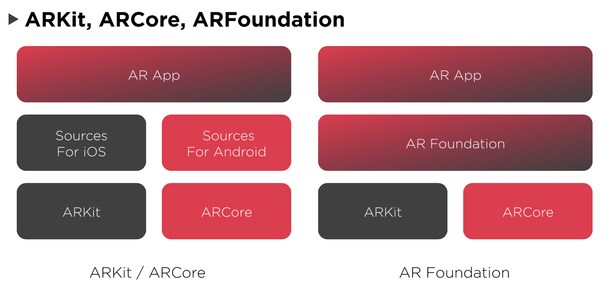
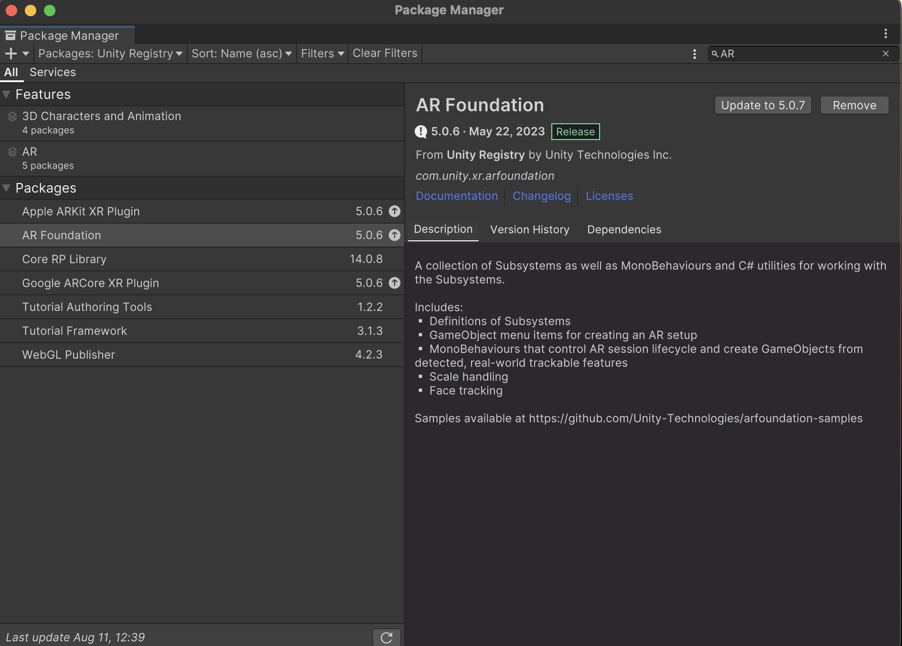
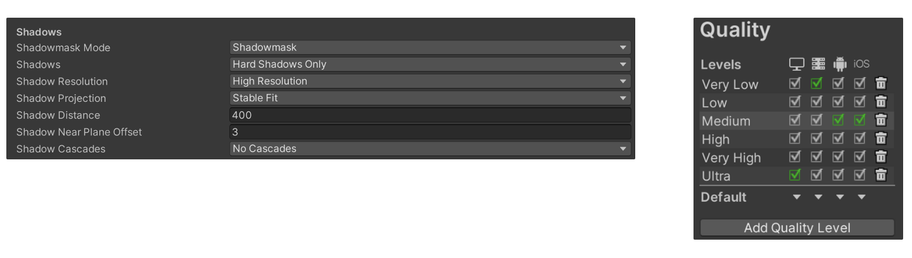
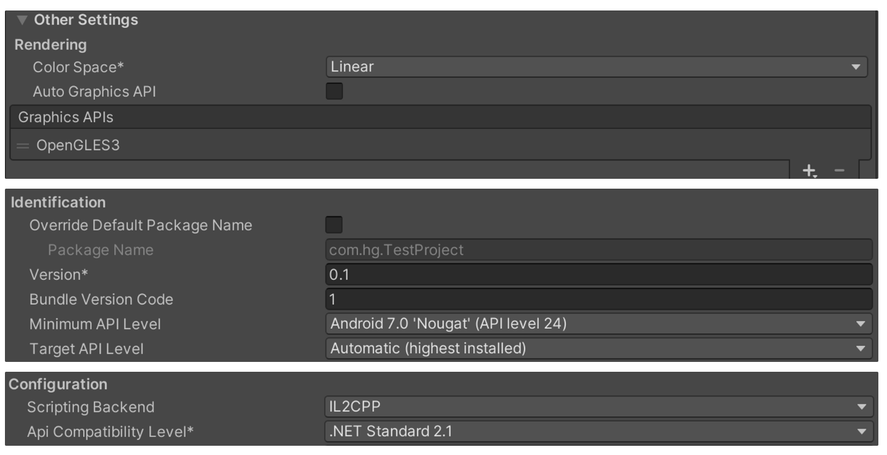
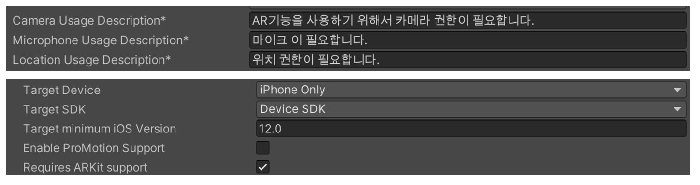

<a name="readme-top"></a>


<!-- PROJECT LOGO -->
<br />
<div align="center">
  
  <h1 align="center">AR Foundation</h1>

  <p align="center">
    AR Setting at Untity 3D
  </p>
</div>


<!-- TABLE OF CONTENTS -->
<details>
  <summary>Table of Contents</summary>
  <ol>
    <li>
      <a href="#about-the-project">About The Project</a>      
    </li>
    <li>
      <a href="#project-setting">Project Setting</a>      
       <ul>
        <li><a href="#Quality">Qaulity</a></li>
        <li><a href="#Android-Setting">Android Setting</a></li>
        <li><a href="#iOS-Setting">iOS Setting</a></li>
      </ul>
    </li>
    <li>
    <a href="#ARFoundation-samples">ARFoundation Samples</a>      
    </li>
  </ol>
</details>


<!-- ABOUT THE PROJECT -->
## About The Project





ARFoundation이 제공하는 기능

* World tracking : 카메라를 통해서 화면을 바라볼때 x,y,z 좌표로 표현이 가능하고 계속 tracking
* Plane detection :  평면을 찾아준다.
* Point clouds 
* Light estimation : 현재 빛 상태를 알 수 있다. Unity에서 빛 강도 조절
* Face tracking : 얼굴에 랜드마크를 추출해서 얼굴이 어디에 있는지 알 수 있다. iOS에서는 deepth 카메라가 있기 때문에 표정도 tracking 가능
* Image tracking  : 마커 위에 이미지를 그릴 수 있다.


<p align="right">(<a href="#readme-top">back to top</a>)</p>

## Project Setting


<p align="right">(<a href="#readme-top">back to top</a>)</p>


### Quality


<p align="right">(<a href="#readme-top">back to top</a>)</p>


### Android Setting

IL2CPP로 설정시 주의점 : Project 경로에 한글 및 특수문자 포함시(뛰어쓰기 포함) 빌드 실패


<p align="right">(<a href="#readme-top">back to top</a>)</p>


### iOS Setting

Xcode 빌드시 문제점

same problem here ... I have commented out these lines on Unity.XR.ArFoundation.Samples.cpp

```c#
   IL2CPP_EXTERN_C intptr_t DEFAULT_CALL q(); IL2CPP_EXTERN_C void DEFAULT_CALL DoSomethingWithSession(intptr_t); IL2CPP_EXTERN_C void DEFAULT_CALL ARSession_addGeoAnchor(intptr_t, CLLocationCoordinate2D_t9A0DD6762E16ECA16EEEC69ACFD9644AA0669871, double);
```


https://stackoverflow.com/questions/73845954/unity-to-ios-xcode-error-undefined-symbols-arfoundation-ar


<p align="right">(<a href="#readme-top">back to top</a>)</p>


## ARFoundation Samples


https://github.com/Unity-Technologies/arfoundation-samples

1. ARSession 추가
2. XR Origin 추가
3. 인식을 하려는 AR Manager 추가